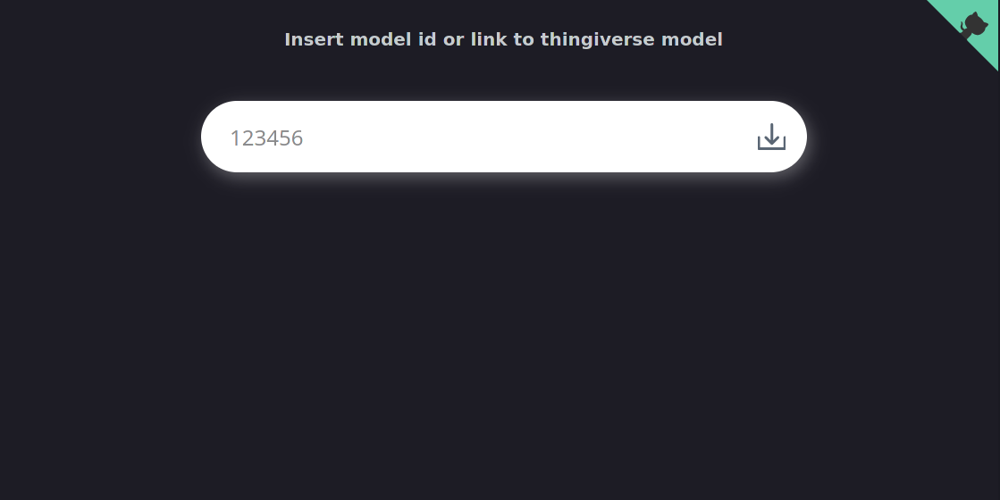

# Thingiverse Zip Downloader


A scraper to bundle a zip archive with all stl files of one model found on [Thingiverse](https://www.thingiverse.com/).
\
Since they struggled around a lot with the **_download all files_** function on their website, they now completely
removed it. For me, it is pita to download every file on it's own. I decided to make a quick poc for my personal use,
and now I like to share it with maker/creator/programmer and many more :)

## Status

Working poc (proof of concept), works for private personal use.



## Installation

First clone the repo to your local environment and enter the directory

```zsh
git clone https://github.com/ThomasBoom89/thingiverse-zip-downloader
cd thingiverse-zip-downloader
```

### Option a: run with docker-compose (recommended)

Start the container (maybe change port mapping to unallocated port)

```zsh
docker-compose up -d
```

### Option b: run with PHP directly on pc

You also can use PHP built in webserver. You will need the following php extension: _dom, sockets, zip, json, curl_.
Composer must be installed on your system and also the chromium browser as well. Currently, the name of the executable
used is chromium-browser, if the name of the chromium executable differs from this, you have to change it in the source
code. In src/Scraper.php on line 30 you can change it to the path where the application can find it. Then you have to do
an install of the composer dependencies:

```zsh
composer install -o
```

After this, you are ready to start the webserver. Enter the public directory of the repository and start it
(maybe change port mapping to unallocated port)

```zsh
cd public
php -S localhost:80
```

### Finally

Start your preferred browser and navigate to http://localhost:80 (don't forget to change your port here as well)
Paste the full url like _https://www.thingiverse.com/thing:316595_ or just the model id 316595 into the input field and
press the download icon. After a certain time you will be offered a file download including all files in one zip
archive.

## Update

### For option a (docker-compose):

Enter the root directory of the cloned repo and update the repo.

```zsh
git pull
```

After this you have to pull the new image from the registry

```zsh
docker-compose pull
```

And finally restart your running container.

```zsh
docker-compose down && docker-compose up -d
```

### For option b (php internal server)

Check the if your setup has all requirements mentioned in the installation step. Stop the running webserver with Ctrl+C
or kill the process if started in background. Update the repo and start the webserver.

```zsh
git pull
php -S localhost:80
```

## License

Thingiverse-Zip-Downloader, a scraper to bundle a zip archive with all stl files of one model found on thingiverse.com.\
Copyright (C) 2022 ThomasBoom89. GNU GPL3 license (GNU General Public License Version 3).

This program is free software: you can redistribute it and/or modify it under the terms of the GNU General Public
License as published by the Free Software Foundation, either version 3 of the License, or (at your option)
any later version.

This program is distributed in the hope that it will be useful, but WITHOUT ANY WARRANTY; without even the implied
warranty of MERCHANTABILITY or FITNESS FOR A PARTICULAR PURPOSE. See the GNU General Public License for more details.

You should have received a copy of the GNU General Public License along with this program. If not, see:

1. The LICENSE file in this repository.
2. https://www.gnu.org/licenses/.
3. https://www.gnu.org/licenses/gpl-3.0.txt.

However, Thingiverse-Zip-Downloader includes several third-party Open-Source libraries, which are licensed under their
own respective Open-Source licenses. Libraries or projects directly included:

- chrome-php/chrome: [MIT](https://github.com/chrome-php/chrome/blob/master/LICENSE)
- Libraries dynamically referenced via Composer: run `composer license` to get the latest licensing info about all
  dependencies.
